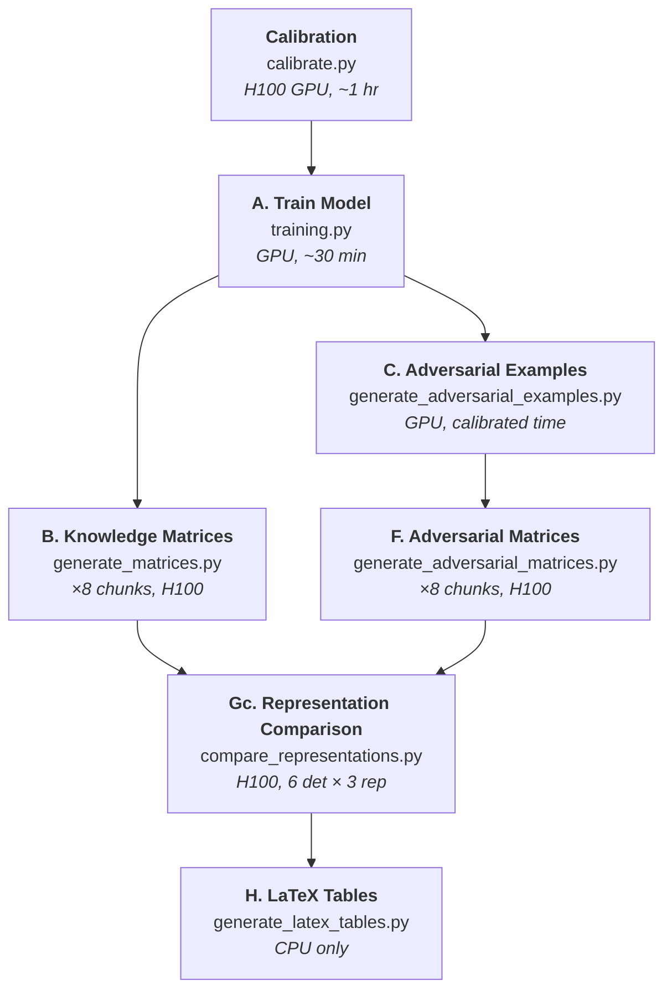

# Hidden Activations Are Not Enough — Rebuttal Experiments

## Representation Comparison (TMLR Resubmission)

This documents the **rebuttal pipeline**, which replaces the original ellipsoid-detector approach with a **6 detectors × 3 representations** factorial experiment. The core question is now: *when the same standard detectors are applied to knowledge matrices instead of penultimate features, does detection improve consistently?*

The pipeline runs end-to-end with a single command:

```bash
bash run_experiment.sh
```

> For the original pipeline and general setup instructions, see [README.md](README.md).

---

## Pipeline Overview

The rebuttal pipeline has 6 stages (down from 9 in the original):



**Removed steps** (vs. original pipeline): D (rejection levels), E (matrix statistics), Ga (KM grid search), Gb (baselines). These are superseded by the unified comparison in Step Gc.

---

## Quick Start

```bash
# Full pipeline (single command)
bash run_experiment.sh

# Dry run (generate scripts only, no submission)
bash run_experiment.sh --dry-run

# Test mode (small samples, ~15 min)
bash run_experiment.sh --test --skip-audit
```

The orchestrator automatically:
- Downloads datasets and pretrained weights if missing
- Calibrates GPU batch_size **and adversarial attack timing** (saved for reuse)
- Submits all stages with correct Slurm dependency chains
- Runs a final audit to verify all outputs

---

## GPU Calibration

The calibration step (`calibrate.py`) now includes **adversarial attack timing** in addition to the original batch_size search.

### What it does

1. **Trains the model for 2 epochs** — measures training time and memory
2. **Binary-searches for the largest `batch_size`** achieving >93% GPU utilization (H100)
3. **Computes ~50 knowledge matrices** — measures average time per matrix
4. **Times each adversarial attack on 10 samples** — extrapolates to full test set, adds 30 min grace period

### Calibration output

```
experiments/alexnet_cifar10/calibration.json
```
```json
{
  "batch_size": 18816,
  "peak_matrix_memory_bytes": 79886131405,
  "avg_seconds_per_matrix": 2.34,
  "slurm_resources": {
    "A": {"time": "00:28:00", "mem": "6G"},
    "B": {"time": "00:08:00", "mem": "96G"},
    "C": {"time": "05:30:00", "mem": "6G", "per_attack_seconds": {"test": 12.3, "GN": 5.1, "...": "..."}},
    "F": {"time": "01:15:00", "mem": "96G"}
  }
}
```

Step C's time is calibrated from actual attack timing (1.15× padding + 1800s grace, 1 hr minimum floor).

---

## Slurm Resource Profiles

| Step | GPU | CPUs | Memory | Time | Notes |
|------|-----|------|--------|------|-------|
| Calibration | H100 | 8 | 64 GB | 1 hr | Runs once, cached |
| A. Training | A100 (10GB) | 3 | 31 GB | 30 min | |
| B. Matrices (×8) | H100 | 12 | 280 GB | 20 min | Parallel chunks |
| C. Adversarial Examples | 1 GPU | 8 | calibrated | calibrated | 17 attacks |
| F. Adv Matrices (×8) | H100 | 12 | 280 GB | 12 hrs | Parallel chunks |
| Gc. Representation Comparison | H100 | 8 | 64 GB | 8 hrs | 6 det × 3 rep + SVD ablation |
| H. LaTeX Tables | -- | 2 | 8 GB | 30 min | CPU only |

---

## Running Individual Steps

### A. Train the Network
```bash
python training.py --experiment_name alexnet_cifar10 --temp_dir $SLURM_TMPDIR
```

### B. Generate Knowledge Matrices
```bash
python generate_matrices.py --experiment alexnet_cifar10 --chunk_id 0 --total_chunks 8 \
    --batch_size 1800 --num_samples_per_class 100 --temp_dir $SLURM_TMPDIR
```

### C. Generate Adversarial Examples
```bash
python generate_adversarial_examples.py --experiment_name alexnet_cifar10 \
    --temp_dir $SLURM_TMPDIR
```

### F. Generate Adversarial Matrices
```bash
python generate_adversarial_matrices.py --experiment_name alexnet_cifar10 \
    --chunk_id 0 --total_chunks 8 --batch_size 1800 --samples_per_attack 500 \
    --temp_dir $SLURM_TMPDIR
```

### Gc. Representation Comparison
```bash
python compare_representations.py --experiment alexnet_cifar10 \
    --temp_dir $SLURM_TMPDIR --svd_ablation
```

### H. Generate LaTeX Tables
```bash
python generate_latex_tables.py --output tables/
```

---

## Experiment Directory Structure

```
experiments/alexnet_cifar10/
|
|-- weights/
|   |-- epoch_10.pth
|   |-- ...
|   +-- epoch_70.pth                       <- Step A
|
|-- matrices/
|   |-- 0/                                 <- Class 0
|   |   |-- 0/matrix.pt
|   |   +-- ...
|   +-- 9/                                 <- Class 9
|
|-- matrices_task_0.zip                    <- Step B (chunk 0)
|-- ...
|-- matrices_task_7.zip                    <- Step B (chunk 7)
|
|-- adversarial_examples/
|   |-- test/adversarial_examples.pth
|   |-- GN/adversarial_examples.pth
|   |-- FGSM/
|   |-- PGD/
|   +-- ...                                <- Step C (17 attacks)
|
|-- adversarial_matrices/
|   |-- test/0/matrix.pth
|   |-- GN/0/matrix.pth
|   +-- ...
|
|-- adv_matrices_task_0.zip                <- Step F (chunk 0)
|-- ...
|-- adv_matrices_task_7.zip                <- Step F (chunk 7)
|
|-- comparison/
|   +-- representation_comparison.json     <- Step Gc (main results)
|
|-- calibration.json                       <- Calibration results
|-- checkpoints/                           <- Per-step completion tracking
+-- orchestrator_jobs/                     <- Generated Slurm scripts

tables/
|-- representation_comparison.tex          <- Step H
|-- per_attack_auroc_*.tex
|-- cost_comparison.tex
+-- svd_ablation_*.tex
```

---

## Available Experiments

| Name | Architecture | Dataset | Epochs |
|------|-------------|---------|--------|
| `lenet_cifar10` | LeNet CNN | CIFAR-10 | 507 |
| `alexnet_cifar10` | AlexNet (pretrained) | CIFAR-10 | 70 |
| `resnet_cifar10` | ResNet18 | CIFAR-10 | 100 |
| `vgg_cifar10` | VGG11 | CIFAR-10 | 150 |

---

## Repository Structure

```
.
|-- run_experiment.sh              <- Pipeline orchestrator (single command)
|-- calibrate.py                   <- GPU calibration (batch_size + attack timing)
|-- training.py                    <- Step A: model training
|-- generate_matrices.py           <- Step B: knowledge matrix computation
|-- generate_adversarial_examples.py <- Step C: adversarial attacks (17 methods)
|-- generate_adversarial_matrices.py <- Step F: matrices for adversarial examples
|-- compare_representations.py     <- Step Gc: 6 detectors × 3 representations
|-- generate_latex_tables.py       <- Step H: LaTeX comparison tables
|-- constants/
|   +-- constants.py               <- Experiment configs, architectures, attacks
|-- utils/
|   |-- utils.py                   <- Model loading, datasets, utilities
|   +-- data_integrity.py          <- Zip verification, experiment auditing
|-- matrix_construction/
|   |-- parallel.py                <- Parallel matrix computation
|   +-- matrix_computation.py      <- Core matrix computation logic
|-- unit_test/
|   +-- test_detectors.py          <- Unit tests for 6 detectors
+-- experiments/                   <- Experiment outputs (auto-created)
```

---

## Key Arguments for Reviewers

### Factorial design eliminates confounds
The same 6 detectors (Mahalanobis, KNN, KDE, GMM, OCSVM, Isolation Forest) with identical hyperparameters are applied to each of the 3 representations (penultimate features, knowledge matrices, SVD-reduced knowledge matrices). Any performance difference is due entirely to the representation.

### SVD ablation controls for dimensionality
Knowledge matrices are 8–75× larger than penultimate features before SVD. The SVD rank ablation (ranks 16–512) tests whether the advantage is **structural** (algebraic structure of quiver representations) or merely **dimensional** (more raw features).

### Metrics
AUROC + AUPR + FPR@95TPR, following Carlini et al. (2019) and RobustBench conventions.
