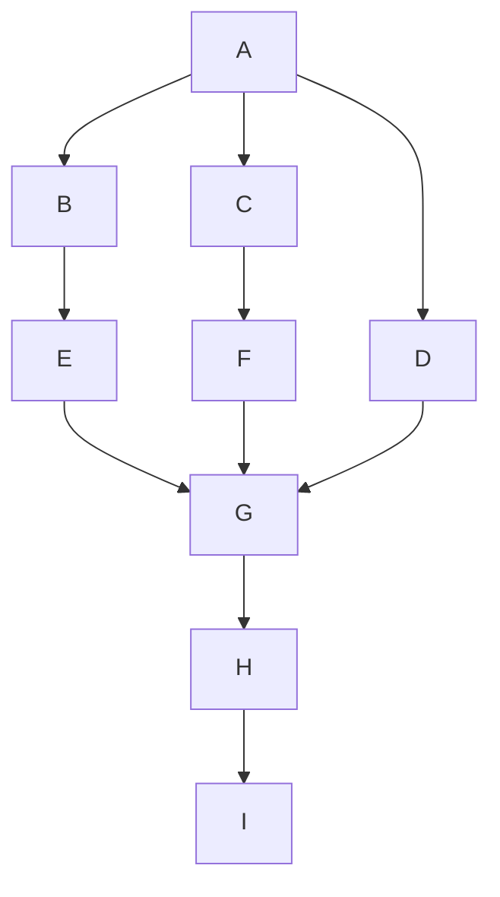

# MatrixStatistics

This repository refers to the paper: Matrix Statistics for Data Representations of Neural Networks

## Repository content

* [constants](constants/constants.py) : contains the MLP architectures used with the 17 different hyperparameters used to train them, as well as the adversarial attack methods used. 
* [matrix_construction](matrix_construction): contains the functions for constructing the matrices induced by a neural network. 
* [mlp](model_zoo/mlp.py): contains the mlp model that saves activations and pre-activations of neurons on a single forward pass to later construct a quiver representation and the induced matrices. 
* [test_mlp_rep](unit_test/test_mlp_rep.py): contains unit testing for constructing an induced quiver representation for random inputs on random MLP architectures. 
* [utils](utils/utils.py): contains utils for datasets, models, computation of mean and standard deviation of matrices, etc.

## Setting up 
First, create a virtual environment and install requirements. It must be named `matrix`, as later scripts will use this environment name.

```bash
virtualenv matrix
source matrix/bin/activate
pip install -r requirements.txt
```

## Running experiments

For a fixed index `idx` between 0 and 16 you train the corresponding default experiment specified in `constants/constants.py`.
You can manually add more default experiments to the DEFAULT_EXPERIMENTS dictionary in `constants/constants.py` by specifying their architecture and training hyperparameters.

### Hierarchy of experiment directory

The subsequent scripts will create a directory `experiments` in which a subdirectory `experiments/{idx}/` will contain all the metadata for default experiment with index `idx`.

### Order for running scripts
Here is a diagram with the order in which to run each script (or job if using a SLURM cluster). The description of each what each script does and how to run it is down below.




### A. Train the networks
To train a network run the training script like this:

```bash
python training.py --default_index {idx}
```
This will save the weights and training history in `experiments/{idx}/weights/`.
If you have access to a SLURM cluster, run the following job
```bash
sbatch job_training.sh
```
The variable `$SLURM_ARRAY_TASK_ID` determines the index of the experiment.
### B. Generate matrices
To generate matrices on a trained network run the following:

```bash
python generate_matrices.py --default_index {idx} --num_samples_per_class {num} --nb_workers {workers}
```

By default, `num=1000` and 'workers=8`. This will create and save all the matrices in the directory `experiments/{idx}/matrices/{k}` where `k` runs over all the classes in the dataset. 
If you have access to a SLURM cluster, run the following job
```bash
sbatch job_matrices.sh
```
The variable `$SLURM_ARRAY_TASK_ID` determines the index of the experiment.
### C. Generate adversarial examples
To generate adversarial examples on the 21 attack methods specified in `constants/constants.py` run the following:

```bash
python generate_adversarial_examples.py --default_index {idx} --test_size {ts} --nb_workers {workers}
```
By default, `ts=-1`, which takes the whole test set to compute adversarial examples.
This will create files `experiments/{idx}/adversarial_examples/{attack_method}/adversarial_examples.pth` which contain all the generated adversarial examples per `attack_method`.
If you have access to a SLURM cluster, run the following job
```bash
sbatch job_generate_adv_ex.sh
```
The variable `$SLURM_ARRAY_TASK_ID` determines the index of the experiment.
### D. Compute matrices for rejection level
To generate matrices from a random subset of the train data to later compute the rejection level as specified in the paper, run the following:
```bash
python compute_matrices_for_rejection_level.py --default_index {idx} --num_samples_rejection_level {N} --nb_workers {workers}
```
By default, `N=10k`.
This will create files `experiments/{idx}/rejection_levels/matrices/{i}/matrix.pth` together with the prediction of the network on that sample `experiments/{idx}/rejection_levels/matrices/{i}/prediction.pth`.
If you have access to a SLURM cluster, run the following job
```bash
sbatch job_gen_mat_rej_lev.sh
```
The variable `$SLURM_ARRAY_TASK_ID` determines the index of the experiment.
### E. Compute matrix statistics
To compute matrix statistics, i.e., mean and standard deviation matrices per class run the following:

```bash
python compute_matrix_statistics.py --default_index {idx}
```
This will create a json file in `experiments/{idx}/matrices/matrix_statistics.json`.
If you have access to a SLURM cluster, run the following job
```bash
sbatch job_matrix_statistics.sh
```
The variable `$SLURM_ARRAY_TASK_ID` determines the index of the experiment.
### F. Generate adversarial matrices
To generate the matrices of each adversarial example generated in step 4 run the following:
```bash
python generate_adversarial_matrices.py --default_index {idx} --nb_workers {workers}
```
This will create files `experiments/{idx}/adversarial_matrices/{attack_method}/{i}/matrix.pth` corresponding to the different `attack_method`s where `i` runs from 0 to the total number of adversarial examples generated per attack method.
If you have access to a SLURM cluster, run the following job
```bash
sbatch job_generate_adv_mats.sh
```
The variable `$SLURM_ARRAY_TASK_ID` determines the index of the experiment.
### G. Compute rejection levels
To run a grid search to compute several rejection levels run the following:
```bash
python grid_search.py --default_index {idx} --rej_level 1 --nb_workers {workers}
```
This will create files `experiments/{idx}/rejection_levels/reject_at_s_d.json` for different values of `s, d1`.
If you have access to a SLURM cluster, run the following job
```bash
sbatch job_grid_search.sh
```
The variable `$SLURM_ARRAY_TASK_ID` determines the index of the experiment. **WARNING** You have to manually change the variable `--rej_lev 1` at the bottom of the shell file to compute rejection levels.
### H. Detect adversarial examples
To run the detection algorithm using the pre-computed rejection levels run the following:
```bash
python grid_search.py --default_index {idx} --rej_level 0 --nb_workers {workers}
```
This will create a file `experiments/{idx}/grid_search/grid_search_{idx}.txt` which contains the percentages of good defence and wrong rejections for each combination of the parameters `s, d1, d2`.
If you have access to a SLURM cluster, run the following job
```bash
sbatch job_grid_search.sh
```
The variable `$SLURM_ARRAY_TASK_ID` determines the index of the experiment. **WARNING** You have to manually change the variable `--rej_lev 0` at the bottom of the shell file to run the detection algorithm with the precomputed rejection levels.
### I. Read results
To filter the results from the grid search run the following:
```bash
python read_results.py --default_index {idx}
```
This will create files `experiments/{idx}/results/{i}_output_{s}_{d1}_{d2}.txt` containing the output of the detection algorithm ran with parameters `s, d1, d2` with the top 3 results given by `i=0,1,2`.
If you have access to a SLURM cluster, run the following job
```bash
sbatch job_read_results.sh
```
The variable `$SLURM_ARRAY_TASK_ID` determines the index of the experiment.
