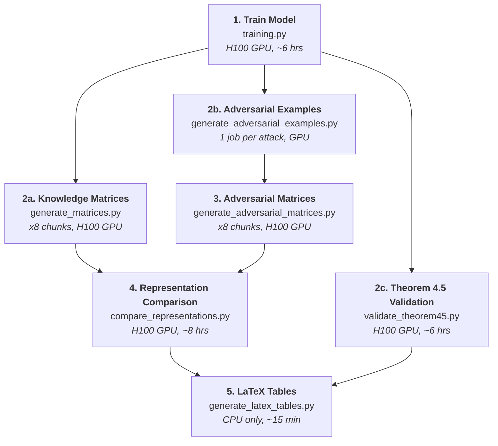

# Hidden Activations Are Not Enough

## A General Approach to Neural Network Predictions

This repository implements the paper [Hidden Activations Are Not Enough: A General Approach to Neural Network Predictions](https://arxiv.org/abs/2409.13163) by Samuel Leblanc, Aiky Rasolomanana, and Marco Armenta.

Given a neural network and a data sample, we compute a **knowledge matrix** (via quiver representations). These matrices capture the full linear behavior of the network at each input point. We use them to detect adversarial examples by comparing new samples' matrices against per-class statistics (mean and standard deviation) computed from the training set.

---

## Pipeline Overview

The experiment pipeline has 7 steps with the following dependency structure:


```mermaid
flowchart TD
    S1["<b>1. Train Model</b><br/>training.py<br/><i>H100 GPU, ~6 hrs</i>"]
    S2a["<b>2a. Knowledge Matrices</b><br/>generate_matrices.py<br/><i>x8 chunks, H100 GPU</i>"]
    S2b["<b>2b. Adversarial Examples</b><br/>generate_adversarial_examples.py<br/><i>1 job per attack, GPU</i>"]
    S2c["<b>2c. Theorem 4.5 Validation</b><br/>validate_theorem45.py<br/><i>H100 GPU, ~6 hrs</i>"]
    S3["<b>3. Adversarial Matrices</b><br/>generate_adversarial_matrices.py<br/><i>x8 chunks, H100 GPU</i>"]
    S4["<b>4. Representation Comparison</b><br/>compare_representations.py<br/><i>H100 GPU, ~8 hrs</i>"]
    S5["<b>5. LaTeX Tables</b><br/>generate_latex_tables.py<br/><i>CPU only, ~15 min</i>"]

    S1 --> S2a
    S1 --> S2b
    S1 --> S2c
    S2a --> S4
    S2b --> S3
    S3 --> S4
    S4 --> S5
    S2c --> S5
```

> Parallel paths (2a, 2b, 2c) run simultaneously after training completes.
> Step 2b runs one Slurm job per attack method. Step 2c runs in parallel with the 2a/2b/3/4 path.

---

## Quick Start

### 1. Environment Setup

**Local machine:**
```bash
python -m venv venv
source venv/bin/activate
pip install -r requirements.txt
```

**Compute Canada / Alliance cluster:**
```bash
module load StdEnv/2023 python/3.11.5 scipy-stack/2025a
virtualenv env_rorqual
source env_rorqual/bin/activate
pip install --no-index --upgrade pip
pip install -r requirements-slurm.txt
pip install git+https://github.com/samueleblanc/knowledgematrix.git
```

### 2. Run an Experiment (Automated)

The **orchestrator** handles the entire pipeline with a single command:

```bash
# Full pipeline for one experiment
bash run_experiment.sh alexnet_cifar10

# With test mode (small samples, short time limits)
bash run_experiment.sh --test alexnet_cifar10

# Dry run (generates scripts without submitting)
bash run_experiment.sh --dry-run alexnet_cifar10
```

Pipeline settings (accounts, resource profiles, experiments to run) are configured in `experiment_config.sh`:

```bash
# Edit experiment_config.sh to change:
ACCOUNT="def-assem"          # Slurm billing account
TOTAL_CHUNKS=8               # Parallel chunks for matrix jobs
BATCH_SIZE=1800              # Matrix computation batch size
NUM_SAMPLES_PER_CLASS=500    # Training samples per class for matrices
SAMPLES_PER_ATTACK=500       # Adversarial examples per attack method
ENV_NAME="env"               # Python virtual environment name
EXPERIMENTS=("alexnet_cifar10")  # Experiments to process
```

The orchestrator automatically:
- Downloads datasets and pretrained weights if missing
- Validates experiment names against `constants/constants.py`
- Calibrates GPU batch_size and estimates pipeline duration (saved for reuse)
- Submits all pipeline steps with correct Slurm dependency chains
- Tracks per-step completion via checkpoints (`experiments/{exp}/checkpoints/`)
- Runs error scanning and auto-resubmission for OOM/timeout failures

---

## GPU Calibration

The orchestrator includes an automatic GPU calibration step that runs **before** the pipeline to find the optimal `batch_size` for matrix computation.

### What it does

1. **Trains the model for 2 epochs** with the experiment's architecture to measure training time and memory
2. **Binary-searches for the largest `batch_size`** that achieves >93% GPU utilization (H100)
3. **Computes ~50 knowledge matrices** to measure average time per matrix
4. **Saves results** to `experiments/{experiment}/calibration.json` for reuse

### How it works

```
First run:   Calibration job (H100, ~30 min) → saves calibration.json → pipeline uses it
Second run:  Calibration.json exists → skipped → pipeline starts immediately
```

All pipeline steps (2a, 3) read the calibrated `batch_size` from `calibration.json` at runtime. Per-attack resources for step 2b are also calibrated. Time and memory requests for SLURM jobs are estimated from calibration data with safety padding.

### Manual control

```bash
# Run with calibration (default)
bash run_experiment.sh alexnet_cifar10

# Force re-calibration (delete old results first)
rm experiments/alexnet_cifar10/calibration.json
bash run_experiment.sh alexnet_cifar10

# Run calibration standalone
python calibrate.py --experiment_name alexnet_cifar10 --temp_dir $SLURM_TMPDIR
```

### Calibration output

```
experiments/alexnet_cifar10/calibration.json
```
```json
{
  "batch_size": 18816,
  "peak_matrix_memory_bytes": 79886131405,
  "avg_seconds_per_matrix": 2.34,
  "slurm_resources": {
    "1": {"time": "00:28:00", "mem": "6G"},
    "2a": {"time": "00:08:00", "mem": "96G"},
    "2b": {"mem": "32G", "per_attack_slurm": {"FGSM": {"time": "...", "mem": "..."}, ...}},
    "3": {"time": "04:00:00", "mem": "280G"}
  }
}
```

---

## Testing the Pipeline

Use `--test` mode to validate the entire pipeline end-to-end with tiny sample sizes:

```bash
# Quick test (~15 min total)
bash run_experiment.sh --test alexnet_cifar10

# Dry run (generates scripts without submitting)
bash run_experiment.sh --test --dry-run alexnet_cifar10
```

**Test mode parameters:**

| Parameter | Normal | Test |
|-----------|--------|------|
| Chunks | 8 | 2 |
| Batch size | 1800 | 100 |
| Samples/class | 500 | 10 |
| Samples/attack | 500 | 10 |
| Test size (adv examples) | -1 (all) | 100 |

After a test run, check the generated scripts:
```bash
ls experiments/alexnet_cifar10/orchestrator_jobs/
```

---

## Orchestrator Reference

```
bash run_experiment.sh [FLAGS] [experiment_name ...]
```

### Configuration

Pipeline settings are defined in `experiment_config.sh` (accounts, resource profiles, chunk counts, sample sizes, etc.). Edit this file to change defaults.

### Operational Flags

| Flag | Default | Description |
|------|---------|-------------|
| `--test` | off | Test mode with small samples and short time limits |
| `--dry-run` | off | Generate scripts without submitting |
| `--skip-audit` | on | Skip pre-audit, submit full pipeline directly |

Experiment names can be passed as arguments (e.g., `bash run_experiment.sh alexnet_cifar10`). If none are given, the `EXPERIMENTS` array in `experiment_config.sh` is used.

### Modes

**Skip-audit mode** (default): Submits the full pipeline 1→2a/2b/2c→3→4→5 directly. Use for fresh experiments where nothing is precomputed.

**Audit mode** (set `SKIP_AUDIT=false` in the script): Submits a pre-audit job to check what's already computed, then a dispatcher job that reads the audit results and only submits the missing pipeline steps.

### Pre-flight Checks

The orchestrator runs these checks on the login node before submitting jobs:

1. Validates experiment names exist in `DEFAULT_EXPERIMENTS`
2. Checks for required datasets, downloads if missing (CIFAR-10/100, MNIST)
3. Checks for pretrained weights (AlexNet/ResNet/VGG ImageNet), downloads if missing

---

## Slurm Resource Profiles

| Step | GPU | CPUs | Memory | Time |
|------|-----|------|--------|------|
| 1. Training | H100 | 2 | 15 GB | 6 hrs |
| 2a. Matrices (x8) | H100 | 12 | 280 GB | 20 min |
| 2b. Adv Examples (per attack) | 1 GPU | 4 | 32 GB | 3 hrs |
| 2c. Theorem 4.5 | H100 | 4 | 64 GB | 6 hrs |
| 3. Adv Matrices (x8) | H100 | 12 | 280 GB | 12 hrs |
| 4. Rep. Comparison | H100 | 8 | 64 GB | 8 hrs |
| 5. LaTeX Tables | -- | 2 | 4 GB | 15 min |

---

## Running Individual Steps

Each step can be run manually if needed.

### 1. Train the Network
```bash
python training.py --experiment_name alexnet_cifar10 --temp_dir $SLURM_TMPDIR
```
Outputs: `experiments/alexnet_cifar10/weights/epoch_*.pth`

### 2a. Generate Knowledge Matrices
```bash
python generate_matrices.py --experiment alexnet_cifar10 --chunk_id 0 --total_chunks 8 --batch_size 1800
```
Outputs: `experiments/alexnet_cifar10/matrices_task_{0-7}.zip`

### 2b. Generate Adversarial Examples
```bash
python generate_adversarial_examples.py --experiment_name alexnet_cifar10 --temp_dir $SLURM_TMPDIR
```
Outputs: `experiments/alexnet_cifar10/adversarial_examples/{attack}/adversarial_examples.pth`

### 2c. Validate Theorem 4.5
```bash
python validate_theorem45.py --experiment alexnet_cifar10 --temp_dir $SLURM_TMPDIR
```
Outputs: `experiments/alexnet_cifar10/theorem45/theorem45_results.json`

### 3. Generate Adversarial Matrices
```bash
python generate_adversarial_matrices.py --experiment_name alexnet_cifar10 --chunk_id 0 --total_chunks 8
```
Outputs: `experiments/alexnet_cifar10/adv_matrices_task_{0-7}.zip`

### 4. Representation Comparison
```bash
python compare_representations.py --experiment alexnet_cifar10 --temp_dir $SLURM_TMPDIR --svd_ablation
```
Outputs: `experiments/alexnet_cifar10/comparison/representation_comparison.json`

### 5. Generate LaTeX Tables
```bash
python generate_latex_tables.py --output tables/
```
Outputs: `tables/*.tex`

---

## Experiment Directory Structure

```
experiments/alexnet_cifar10/
|
|-- weights/
|   |-- epoch_10.pth
|   |-- epoch_20.pth
|   |-- ...
|   +-- epoch_70.pth                       <- Step 1
|
|-- matrices_task_0.zip                    <- Step 2a (chunk 0)
|-- matrices_task_1.zip
|-- ...
|-- matrices_task_7.zip                    <- Step 2a (chunk 7)
|
|-- adversarial_examples/
|   |-- test/
|   |   |-- adversarial_examples.pth
|   |   +-- labels.pth
|   |-- GN/
|   |   |-- adversarial_examples.pth
|   |   +-- wrong_predictions.pth
|   |-- FGSM/
|   |-- PGD/
|   +-- ...                                <- Step 2b (17 attacks)
|
|-- adv_matrices_task_0.zip                <- Step 3 (chunk 0)
|-- ...
|-- adv_matrices_task_7.zip                <- Step 3 (chunk 7)
|
|-- comparison/
|   +-- representation_comparison.json     <- Step 4
|
|-- theorem45/
|   +-- theorem45_results.json             <- Step 2c
|
|-- calibration.json                       <- GPU calibration results
|-- checkpoints/                           <- Per-step completion tracking
|   |-- step_1.json
|   |-- step_2a_chunk_0.json ... step_2a_chunk_7.json
|   |-- step_2b_attack_FGSM.json ... (per-attack)
|   |-- step_2c.json
|   |-- step_3_chunk_0.json ... step_3_chunk_7.json
|   |-- step_4.json
|   +-- step_5.json
+-- orchestrator_jobs/                     <- Generated Slurm scripts

tables/*.tex                               <- Step 5 (LaTeX tables)
```

---

## Logs

Slurm job output and error logs are saved in separate directories depending on the mode:

| Mode | Output logs | Error logs |
|------|------------|------------|
| Normal | `slurm_out/` | `slurm_err/` |
| Test (`--test`) | `slurm_out_test/` | `slurm_err_test/` |

Log filenames follow the pattern: `PIPE_{step}_{experiment}[_c{chunk}]_{jobid}.out`

Examples:
- `PIPE_1_alexnet_cifar10_12345.out` — Step 1 (training)
- `PIPE_2a_alexnet_cifar10_c0_12345.out` — Step 2a (chunk 0)
- `PIPE_2b_alexnet_cifar10_FGSM_12345.out` — Step 2b (per-attack, includes attack name)
- `PIPE_3_alexnet_cifar10_c0_12345.out` — Step 3 (chunk 0)
- `PIPE_4_alexnet_cifar10_12345.out` — Step 4
- `PIPE_2c_alexnet_cifar10_12345.out` — Step 2c
- `PIPE_5_alexnet_cifar10_12345.out` — Step 5

GPU monitoring logs are saved to `gpu-monitor/` with the pattern `{experiment}.{step}.{chunk}.log` (e.g., `alexnet_cifar10.2b.FGSM.log`).

### Collecting Test Diagnostics

After a test run, collect all errors and outputs into a single file for debugging:

```bash
# After running --test mode
bash collect_test_logs.sh

# After running normal mode
bash collect_test_logs.sh normal
```

This produces `test_diagnostics.txt` containing:
- Recent job summary (states, exit codes, elapsed time)
- Calibration output and JSON
- All non-empty error logs (last 50 lines each)
- All step outputs (last 30 lines each)

Share this single file when reporting issues.

### Pipeline Reports

Generate a comprehensive report of how the pipeline ran — job statuses, artifact verification, error analysis, GPU monitoring, and recovery recommendations:

```bash
# After a normal pipeline run
python pipeline_report.py --experiment alexnet_cifar10

# After a test run (reads from slurm_out_test/)
python pipeline_report.py --experiment alexnet_cifar10 --test --total-chunks 2
```

Reports are saved to `reports/{experiment}_report_{timestamp}.txt` and never overwrite each other. Each report contains:

1. **Job Status Summary** — state, exit code, elapsed time, memory for every job
2. **Calibration Results** — batch_size, GPU utilization, estimated step durations
3. **Pipeline Step Completion** — per-step artifact verification (OK/MISSING/CORRUPT)
4. **Error Analysis** — categorized errors (OOM, timeout, network, etc.) with log excerpts
5. **GPU Monitoring Summary** — peak/average utilization and memory from gpu-monitor logs
6. **Recovery Recommendations** — what to re-run, with dependency propagation

---

## Available Experiments

Experiments are defined in `constants/constants.py`. Key experiments:

| Name | Architecture | Dataset | Epochs |
|------|-------------|---------|--------|
| `alexnet_cifar10` | AlexNet (pretrained) | CIFAR-10 | 70 |
| `resnet_cifar10` | ResNet18 | CIFAR-10 | 100 |
| `resnet_cifar100` | ResNet18 | CIFAR-100 | 100 |
| `vgg_cifar100` | VGG11 | CIFAR-100 | 150 |
| `mlp_mnist` | MLP (512x3) | MNIST | 5 |
| `lenet_cifar10` | LeNet CNN | CIFAR-10 | 507 |

### Adding New Experiments

Add an entry to `DEFAULT_EXPERIMENTS` in `constants/constants.py`:

```python
'my_experiment': {
    'dataset': 'cifar10',           # mnist, fashion, cifar10, cifar100, imagenet
    'architecture_index': -3,       # -3=AlexNet, -2=ResNet18, -1=VGG11, -4=LeNet
    'epochs': 50,
    'batch_size': 32,
    'lr': 0.001,
    'optimizer': 'adam',            # adam, sgd
    'momentum': 0.0,
    'weight_decay': 0.001,
    'scheduler': 'multi',          # step, cosine, exp, multi, cyclic
}
```

Then run:
```bash
bash run_experiment.sh my_experiment
```

---

## Adversarial Attacks

The pipeline tests 17 adversarial attack methods (from `torchattacks`):

| Category | Attacks |
|----------|---------|
| Noise | GN (Gaussian Noise) |
| Gradient-based | FGSM, PGD, EOTPGD, MIFGSM, VMIFGSM |
| Optimization-based | CW (Carlini-Wagner), DeepFool, Pixle |
| AutoAttack family | APGD, APGDT, FAB, Square |
| Other | SPSA, EADL1, EADEN |

Attacks that fail to produce any misclassified examples are automatically skipped (logged as warnings). Individual attack failures do not crash the pipeline.

---

## Data Integrity and Auditing

The audit system (`utils/data_integrity.py`) verifies all experiment artifacts:

```bash
# Run a standalone audit
sbatch job_audit.sh

# Run recovery for failed steps
bash job_recovery.sh
```

The audit checks:
- All matrix zip files exist and are valid
- `.pth` tensors inside zips can be loaded (random 10% sample)
- All adversarial example files exist
- Comparison results JSON exists

The checkpoint system (`experiments/{exp}/checkpoints/step_*.json`) tracks per-step completion. Recovery plans are auto-generated with dependency propagation (e.g., if Step 1 fails, all downstream steps are also flagged for re-run).

---

## Error Resilience

The pipeline handles errors gracefully:

- **Numerical errors** in matrix computation (NaN/Inf from activation ratios): automatically replaced with zeros, individual matrices that fail entirely are skipped with a warning
- **Adversarial attack failures**: attacks that crash or produce 0 adversarial examples are skipped, logged, and the pipeline continues
- **Zip corruption**: verified before copying to permanent storage; corrupted files trigger re-computation
- **OOM / timeout failures**: the error scanner (`collect_errors.py`) classifies failures and `auto_resubmit.py` resubmits with doubled memory or time

---

## Troubleshooting

| Problem | Solution |
|---------|----------|
| `TypeError: AlexNet.__init__() got an unexpected keyword argument 'freeze_features'` | Update the `knowledgematrix` package: `pip install --upgrade git+https://github.com/samueleblanc/knowledgematrix.git` |
| `FileNotFoundError: pretrained-weights.pth` | Run the orchestrator, which downloads pretrained weights automatically. Or manually: `python -c "from torchvision.models import alexnet, AlexNet_Weights; import torch; torch.save(alexnet(weights=AlexNet_Weights.DEFAULT).state_dict(), 'experiments/alexnet_imagenet/weights/pretrained-weights.pth')"` |
| Out of memory on GPU | Reduce `BATCH_SIZE` in `experiment_config.sh` (e.g., from 1800 to 900) |
| Job timeout | Increase time limits in `experiment_config.sh` (e.g., `S3_TIME`) |
| Missing dataset on compute node | The orchestrator downloads datasets during pre-flight checks. For manual runs: `python -c "from torchvision.datasets import CIFAR10; CIFAR10(root='./data', train=True, download=True)"` |

---

## Repository Structure

```
.
|-- experiment_config.sh              <- Shared config (accounts, resources, defaults)
|-- run_experiment.sh                 <- Pipeline orchestrator (start here)
|-- calibration.sh                    <- Standalone GPU calibration (wraps calibrate.py)
|-- calibrate.py                      <- GPU calibration (batch_size + timing)
|-- pipeline_report.py                <- Post-run pipeline report (job status, errors, recommendations)
|-- collect_test_logs.sh              <- Collect test diagnostics into one file
|-- collect_errors.py                 <- Error classification and scanning
|-- auto_resubmit.py                  <- Auto-resubmit failed jobs with more resources
|-- training.py                       <- Step 1: model training
|-- generate_matrices.py              <- Step 2a: knowledge matrix computation
|-- generate_adversarial_examples.py  <- Step 2b: adversarial attacks (per-attack parallel)
|-- validate_theorem45.py             <- Step 2c: Theorem 4.5 empirical validation
|-- generate_adversarial_matrices.py  <- Step 3: matrices for adversarial examples
|-- compare_representations.py        <- Step 4: representation comparison (6 detectors x 3 reps)
|-- generate_latex_tables.py          <- Step 5: LaTeX table generation
|-- baselines/
|   +-- lee2018.py                    <- Lee et al. (2018) Mahalanobis baseline
|-- constants/
|   +-- constants.py                  <- Experiment configs, architectures, attacks
|-- utils/
|   |-- utils.py                      <- Model loading, datasets, utilities
|   |-- data_integrity.py             <- Zip verification, experiment auditing
|   +-- error_classification.py       <- Error pattern matching for log analysis
|-- matrix_construction/
|   |-- parallel.py                   <- Parallel matrix computation
|   +-- matrix_computation.py         <- Core matrix computation logic
|-- model_zoo/                        <- Local model implementations
|-- unit_test/                        <- Unit tests
|-- job_*.sh                          <- Individual Slurm job scripts
+-- experiments/                      <- Experiment outputs (auto-created)
```

<!-- PIPELINE-DOCS:START -->
## SLURM Pipelines

### Main Experiment Pipeline

Runs the full 7-step experiment for one or more model/dataset configurations. Trains a neural network, computes knowledge matrices for clean and adversarial data, evaluates 6 detectors on 3 representations, validates Theorem 4.5, and generates LaTeX comparison tables.

#### Quick Start

1. Ensure datasets are downloaded in `data/` (CIFAR-10/100 auto-download on login node)
2. Create the virtual environment: `python -m venv env && source env/bin/activate && pip install -r requirements.txt`
3. Run GPU calibration first (recommended):

```bash
bash calibration.sh
```

4. Launch the pipeline for a single experiment:

```bash
bash run_experiment.sh alexnet_cifar10
```

Other modes:
```bash
bash run_experiment.sh --test --skip-audit alexnet_cifar10   # Quick test (small samples)
bash run_experiment.sh --dry-run --test alexnet_cifar10       # Dry run (scripts only)
bash run_experiment.sh --skip-audit alexnet_cifar10           # Skip pre-audit
bash run_all_experiments.sh                                    # All experiments
```

After submission, jobs execute on the cluster. Check status with `squeue -u $USER`.

#### Pipeline Execution Order

```
Step A (Training) ──> Step B ×8 (Clean Matrices)
                  ──> Step C ×17 (Adversarial Examples, per-attack)
                  ──> Step G (Theorem 4.5 Validation)
Step A + C[all]  ──> Step D ×8 (Adversarial Matrices)
A + B + C + D    ──> Step E (Representation Comparison + SVD Ablation)
E + G            ──> Step F (LaTeX Tables)
E + G + F        ──> Final Audit
ALL jobs         ──> Error Scan + Auto-Retry (afterany)
```

1. **Step A — Training** — Trains the neural network model. Single H100 GPU job.
   - Depends on: nothing
   - Runs: `python training.py --experiment_name <EXP> --temp_dir $SLURM_TMPDIR`

2. **Step B ×8 — Clean Matrices** — Computes knowledge matrices for training data, 8 parallel chunks.
   - Depends on: Step A (afterok)
   - Runs: `python generate_matrices.py --chunk_id <i> --total_chunks 8 ...`
   - Features: incremental save, SIGUSR1 emergency save before wall-time kill

3. **Step C ×17 — Adversarial Examples** — Generates adversarial examples, one job per attack method (16 attacks + 1 clean pass-through).
   - Depends on: Step A (afterok)
   - Runs: `python generate_adversarial_examples.py --attacks <ATTACK> ...`

4. **Step G — Theorem 4.5 Validation** — Empirical validation of the distance lower bound.
   - Depends on: Step A (afterok). Runs independently of B, C, D, E.
   - Runs: `python validate_theorem45.py --num_samples 200 ...`

5. **Step D ×8 — Adversarial Matrices** — Computes knowledge matrices for adversarial data, 8 parallel chunks.
   - Depends on: Step A + all Step C (afterok)
   - Runs: `python generate_adversarial_matrices.py --chunk_id <i> ...`
   - Features: incremental save, SIGUSR1 emergency save

6. **Step E — Representation Comparison** — 6 detectors × 3 representations + Lee et al. baseline + SVD ablation.
   - Depends on: Steps A + B[all] + C[all] + D[all] (afterok)
   - Runs: `python compare_representations.py --svd_ablation ...`

7. **Step F — LaTeX Tables** — Generates comparison tables. CPU-only.
   - Depends on: Steps E + G (afterok)
   - Runs: `python generate_latex_tables.py --output tables/`

8. **Final Audit** — Data integrity verification. CPU-only.
   - Depends on: Steps E + G + F (afterok)

9. **Error Scan + Auto-Retry** — Collects errors, triggers auto-retry with doubled resources.
   - Depends on: ALL jobs (afterany — runs even if upstream fails)
   - Runs: `python collect_errors.py` then `python auto_resubmit.py`

All step-to-step dependencies use SLURM `--dependency=afterok`. The error scan uses `--dependency=afterany`.

#### Configuration

Edit variables in `experiment_config.sh` before running.

| Variable | Default | Description |
|----------|---------|-------------|
| `ACCOUNT` | `"def-assem"` | Compute Canada allocation account |
| `EXPERIMENTS` | `("alexnet_cifar10")` | Which experiments to run |
| `TOTAL_CHUNKS` | `8` | Parallel chunks for Steps B and D |
| `BATCH_SIZE` | `1800` | GPU batch size (overridden by calibration) |
| `NUM_SAMPLES_PER_CLASS` | `500` | Training matrix samples per class |
| `SAMPLES_PER_ATTACK` | `500` | Adversarial samples per attack |
| `ENV_NAME` | `"env"` | Virtual environment directory |
| `MODULES` | `"StdEnv/2023 python/3.11.5 scipy-stack/2025a"` | Cluster modules to load |
| `A_MEM` / `A_TIME` | `"15G"` / `"06:00:00"` | Step A resources (training) |
| `B_MEM` / `B_TIME` | `"280G"` / `"00:20:00"` | Step B resources (matrices) |
| `C_MEM` / `C_TIME` | `"32G"` / `"03:00:00"` | Step C resources (adversarial examples) |
| `D_MEM` / `D_TIME` | `"280G"` / `"12:00:00"` | Step D resources (adversarial matrices) |
| `E_MEM` / `E_TIME` | `"64G"` / `"08:00:00"` | Step E resources (comparison) |
| `G_MEM` / `G_TIME` | `"64G"` / `"06:00:00"` | Step G resources (theorem 4.5) |
| `F_MEM` / `F_TIME` | `"4G"` / `"00:15:00"` | Step F resources (LaTeX, CPU-only) |

Available experiments: `alexnet_cifar10`, `resnet_cifar10`, `resnet_cifar100`, `vgg_cifar100`

#### Checkpointing and Failure Recovery

The pipeline writes per-step JSON checkpoints to `experiments/<EXP>/checkpoints/`. On re-run:

- **Completed steps** are skipped (checkpoint + output artifact verified)
- **Failed steps (OOM)** are resubmitted with doubled memory (exit code 137 or sacct detection)
- **Failed steps (timeout)** are resubmitted with doubled time (exit code 140 or sacct detection)
- **Partial steps** (B, D only) resume from where they left off via per-matrix existence checks

The error scan job runs `auto_resubmit.py` which doubles `--mem` (capped at 480G) and `--time` (capped at 48h) for retryable failures and resubmits the downstream dependency chain. Max 2 automatic retries.

For manual recovery: `sbatch job_audit.sh` then `bash job_recovery.sh <experiment>`.

#### Results & Outputs

All output is written under `experiments/<experiment>/`.

```
experiments/{experiment}/
├── weights/                                    # Step A
│   ├── epoch_{N}.pth                           # Model checkpoints
│   └── history.json                            # Training history
├── matrices_task_{0-7}.zip                     # Step B (zipped clean matrices)
├── adversarial_examples/                       # Step C
│   ├── test/
│   │   ├── adversarial_examples.pth            # Clean passthrough images
│   │   └── labels.pth                          # Ground truth labels
│   └── {attack}/
│       ├── adversarial_examples.pth            # Adversarial images
│       └── wrong_predictions.pth               # Wrong labels
├── adv_matrices_task_{0-7}.zip                 # Step D (zipped adversarial matrices)
├── comparison/
│   └── representation_comparison.json          # Step E (6×3 grid + cost + Lee + SVD)
├── theorem45/
│   └── theorem45_results.json                  # Step G
├── calibration.json                            # GPU calibration results
├── checkpoints/step_*.json                     # Per-step completion tracking
├── orchestrator_jobs/*.sh                      # Generated SLURM scripts
├── overall_errors.json                         # Error collection report
└── audit_report.json                           # Final data integrity audit
tables/*.tex                                    # Step F (LaTeX tables)
```

#### Monitoring

```bash
squeue -u $USER                                              # Check job status
python pipeline_report.py --experiment alexnet_cifar10       # Post-run report
python collect_errors.py --experiment alexnet_cifar10         # Error collection
```

View logs: `slurm_out/PIPE_{STEP}_{EXP}[_c{CHUNK}|_{ATTACK}]_{JOBID}.out`
Check errors: `slurm_err/PIPE_{STEP}_{EXP}[_c{CHUNK}|_{ATTACK}]_{JOBID}.err`
GPU monitoring: `gpu-monitor/{experiment}.{step}.{chunk_or_attack}.log`

### Calibration Pipeline

Runs GPU calibration to determine optimal batch sizes and SLURM resource estimates. Produces `calibration.json` which the main pipeline reads to set appropriate `--mem` and `--time` values.

#### Quick Start

```bash
bash calibration.sh
```

Submits one calibration job per experiment. Skips if `calibration.json` already exists. Results are loaded automatically by `run_experiment.sh`.

#### Configuration

Uses the same `experiment_config.sh` settings. Calibration-specific resources:

| Variable | Default | Description |
|----------|---------|-------------|
| `CALIB_MEM` | `"32G"` | Memory for calibration job |
| `CALIB_TIME` | `"01:00:00"` | Time limit for calibration |
| `CALIB_GPU` | `"--gpus=h100:1"` | GPU type |

### Auto-Retry Pipeline

Not launched directly — triggered automatically by the error scan job at the end of the main pipeline. Reads `overall_errors.json`, identifies OOM/timeout failures, doubles resources in the SLURM scripts, and resubmits the failed step plus all downstream dependencies.

Dependency graph (from `auto_resubmit.py`):
```
A → B ──────────────────→ E → F → AUDIT
A → C → D ──────────────→ E
A → G ────────────────────────→ F
```

Max 2 automatic retries per experiment (tracked in `experiments/<EXP>/auto_retry_count`).

<!-- PIPELINE-DOCS:END -->
