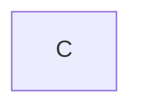
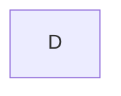
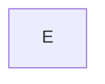
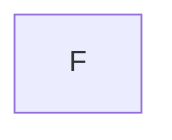
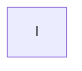

# MatrixStatistics

This repository refers to the paper: Matrix Statistics for Data Representations of Neural Networks

Here is a simplified version of what this code does. Given a neural network and a data sample, we can compute a quiver representation and from it a matrix. We use these induced matrices to detect adversarial examples by converting new data samples fed to the network into matrices and comparing them to statistics taken on a subset of the training set.

You will find code to train MLPs; generate quiver representations on these networks and their corresponding matrices; computation of matrix statistics per class, i.e., mean and standard deviation; generate adversarial examples and the matrices they induce; compute a rejection level based on a subset of the train set (either MNIST or FashionMNIST, although other datasets may be added too) and the detection algorithm explained in the paper through a grid search.

## Repository content

* [constants](constants/constants.py): contains the MLP architectures used with the 17 different hyperparameters used to train them, as well as the adversarial attack methods used. 
* [matrix_construction](matrix_construction): contains the functions for constructing the matrices induced by a neural network. 
* [mlp](model_zoo/mlp.py): contains the MLP model that saves activations and pre-activations of neurons on a single forward pass to later construct a quiver representation and the induced matrices. 
* [test_mlp_rep](unit_test/test_mlp_rep.py): contains unit testing for constructing an induced quiver representation for random inputs on random MLP architectures. 
* [utils](utils/utils.py): contains utils for datasets, models, computation of mean and standard deviation of matrices, etc.

## Setting up 
On a local computer, create a virtual environment and install requirements. It must be named `matrix`, as later scripts will use this environment name.

```bash
virtualenv matrix
source matrix/bin/activate
pip install -r requirements.txt
```
If you have access to a SLURM cluster, the environment should be named `ENV`.
For Alliance clusters, load these modules
`module load StdEnv/2020 python/3.9.6 scipy-stack/2023a`
The scipy-stack module includes: `NumPy, SciPy, Matplotlib, dateutil, pytz, IPython, pyzmq, tornado, pandas, Sympy, nose`
Then create the environment and install dependencies as follows:
```bash
virtualenv ENV
source ENV/bin/activate
pip install --no-index --upgrade pip
pip install -r requirements-slurm.txt
```

## Running experiments

For a fixed index `idx` between 0 and 16 you train the corresponding default experiment specified in `constants/constants.py`.
By specifying their architecture and training hyperparameters, you can manually add more default experiments to the DEFAULT_EXPERIMENTS dictionary in `constants/constants.py`.

Only the training is done on GPU. Every other script runs on CPUs in parallel according to the variable `--nb_workers`.
Default experiments 0 through 8 can easily be run on a laptop or desktop computer.
Default experiments 13, 14, 15 and 16 require a 40 GB GPU to train.

### Hierarchy of experiment directory

The subsequent scripts will create a directory `experiments` in which a subdirectory `experiments/{idx}/` will contain all the metadata for the default experiment with index `idx`.

### Order for running scripts
Here is a diagram with the order to run the scripts (or job if using a SLURM cluster). Below is the description of what each script does and how to run it.


## A. Train the networks

To train a network corresponding to a default index `idx` run the training script like this:
```bash
python training.py --default_index {idx}
```
This will save the weights and training history in `experiments/{idx}/weights/`.
If you have access to a SLURM cluster, run the following job
```bash
sbatch job_training.sh
```
The variable `$SLURM_ARRAY_TASK_ID` determines the index of the experiment. You need to specify an account to charge the computations inside the job script. The job script copies the necessary data for the job to the compute node for smooth computation.
## B. Generate matrices

To generate matrices on a trained network run the following:
```bash
python generate_matrices.py --default_index {idx} --num_samples_per_class {num} --nb_workers {workers}
```
By default, `num=1000` and `workers=8`. This will create and save all the matrices in the directory `experiments/{idx}/matrices/{k}/{i}/` where `k` runs over all the classes in the dataset and `i` goes from 0 to `num-1`. 
If you have access to a SLURM cluster, run the following job
```bash
sbatch job_matrices.sh
```
The variable `$SLURM_ARRAY_TASK_ID` determines the index of the experiment. You need to specify an account to charge the computations inside the job script. The job script copies the necessary data for the job to the compute node for smooth computation.
## C. Generate adversarial examples

To generate adversarial examples on the 21 attack methods specified in `constants/constants.py` run the following:
```bash
python generate_adversarial_examples.py --default_index {idx} --test_size {ts} --nb_workers {workers}
```
By default, `ts=-1`, takes the whole test set to compute adversarial examples.
This will create files `experiments/{idx}/adversarial_examples/{attack_method}/adversarial_examples.pth` which contain all the generated adversarial examples per `attack_method`.
If you have access to a SLURM cluster, run the following job
```bash
sbatch job_generate_adv_ex.sh
```
The variable `$SLURM_ARRAY_TASK_ID` determines the index of the experiment. You need to specify an account to charge the computations inside the job script. The job script copies the necessary data for the job to the compute node for smooth computation.
## D. Compute matrices for rejection level

To generate matrices from a random subset of the train data to later compute the rejection level as specified in the paper, run the following:
```bash
python compute_matrices_for_rejection_level.py --default_index {idx} --num_samples_rejection_level {N} --nb_workers {workers}
```
By default, `N=10k`. This will create files `experiments/{idx}/rejection_levels/matrices/{i}/matrix.pth` together with the corresponding prediction of the network `experiments/{idx}/rejection_levels/matrices/{i}/prediction.pth`, where `i` goes from 0 to `N-1`.
If you have access to a SLURM cluster, run the following job
```bash
sbatch job_gen_mat_rej_lev.sh
```
The variable `$SLURM_ARRAY_TASK_ID` determines the index of the experiment. You need to specify an account to charge the computations inside the job script. The job script copies the necessary data for the job to the compute node for smooth computation.
## E. Compute matrix statistics

To compute matrix statistics, i.e., mean and standard deviation matrices per class run the following:
```bash
python compute_matrix_statistics.py --default_index {idx}
```
This will create the following JSON file `experiments/{idx}/matrices/matrix_statistics.json`.
If you have access to a SLURM cluster, run the following job
```bash
sbatch job_matrix_statistics.sh
```
The variable `$SLURM_ARRAY_TASK_ID` determines the index of the experiment. You need to specify an account to charge the computations inside the job script. The job script copies the necessary data for the job to the compute node for smooth computations. This script does not require parallel computation and only 1 CPU will suffice.
## F. Generate adversarial matrices

To generate the matrices of each adversarial example generated in step 4 run the following:
```bash
python generate_adversarial_matrices.py --default_index {idx} --nb_workers {workers}
```
This will create files `experiments/{idx}/adversarial_matrices/{attack_method}/{i}/matrix.pth` corresponding to the different `attack_method`s where `i` runs from 0 to the total number of adversarial examples generated per attack method.
If you have access to a SLURM cluster, run the following job
```bash
sbatch job_generate_adv_mats.sh
```
The variable `$SLURM_ARRAY_TASK_ID` determines the index of the experiment. You need to specify an account to charge the computations inside the job script. The job script copies the necessary data for the job to the compute node for smooth computation.
## G. Compute rejection levels

To run a grid search to compute several rejection levels run the following:
```bash
python grid_search.py --default_index {idx} --rej_level 1 --nb_workers {workers}
```
This will create files `experiments/{idx}/rejection_levels/reject_at_{s}_{d1}.json` for different values of `s, d1`.
If you have access to a SLURM cluster, run the following job
```bash
sbatch job_grid_search.sh
```
The variable `$SLURM_ARRAY_TASK_ID` determines the index of the experiment. You need to specify an account to charge the computations inside the job script. The job script copies the necessary data for the job to the compute node for smooth computation.
**WARNING** You have to manually change the variable `--rej_lev 1` at the bottom of the shell file to compute rejection levels.
## H. Detect adversarial examples

To run the detection algorithm using the pre-computed rejection levels run the following:
```bash
python grid_search.py --default_index {idx} --rej_level 0 --nb_workers {workers}
```
This will create a file `experiments/{idx}/grid_search/grid_search_{idx}.txt` which contains the percentages of good defence and wrong rejection for each combination of the parameters `s, d1, d2`.
If you have access to a SLURM cluster, run the following job
```bash
sbatch job_grid_search.sh
```
The variable `$SLURM_ARRAY_TASK_ID` determines the index of the experiment. You need to specify an account to charge the computations inside the job script. The job script copies the necessary data for the job to the compute node for smooth computation.
**WARNING** You have to manually change the variable `--rej_lev 0` at the bottom of the shell file to run the detection algorithm with the pre-computed rejection levels.
### I. Read results

To filter the results from the grid search run the following:
```bash
python read_results.py --default_index {idx}
```
This will create files `experiments/{idx}/results/{i}_output_{s}_{d1}_{d2}.txt` containing the output of the detection algorithm ran with parameters `s, d1, d2` with the top 3 results given by `i=0,1,2`.
If you have access to a SLURM cluster, run the following job
```bash
sbatch job_read_results.sh
```
The variable `$SLURM_ARRAY_TASK_ID` determines the index of the experiment. You need to specify an account to charge the computations inside the job script. The job script copies the necessary data for the job to the compute node for smooth computation. This script does not require parallel computation and only 1 CPU will suffice.
